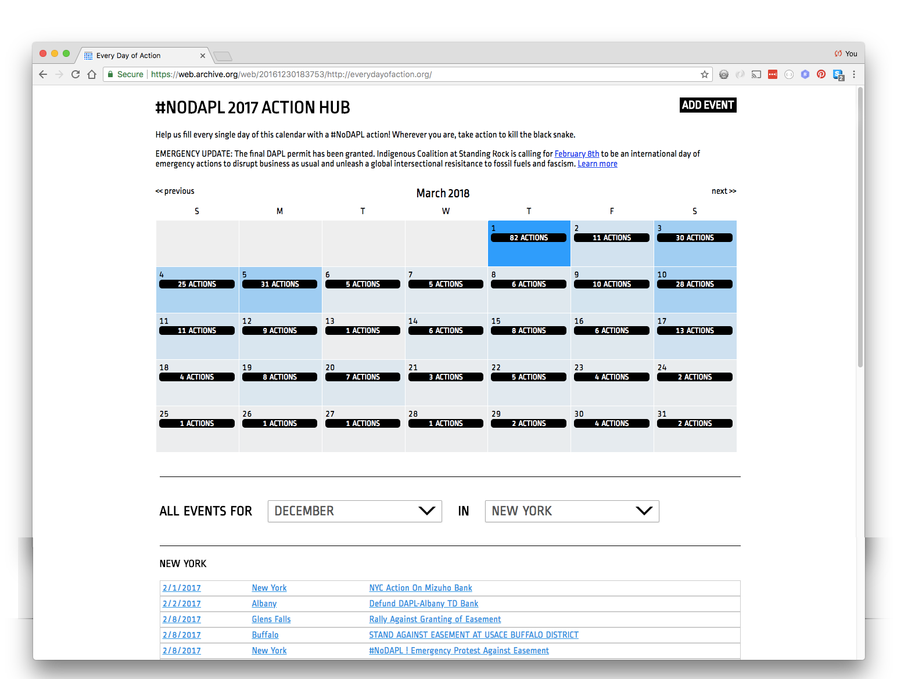
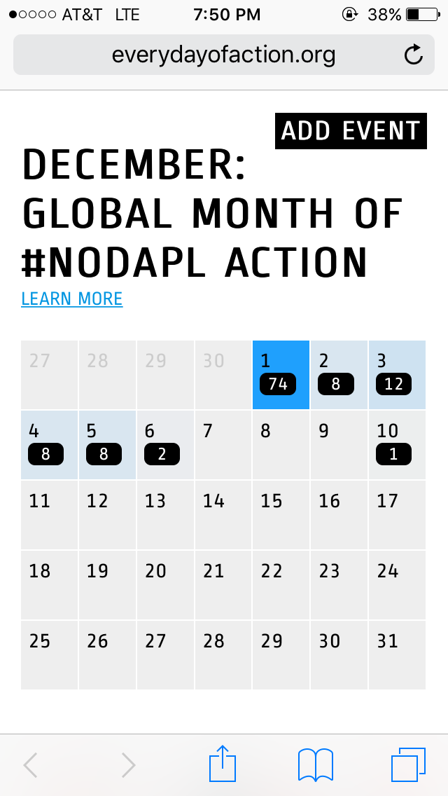

# Every Day of Action
This tool was built in collaboration with [NoDAPL](https://www.democracynow.org/2017/2/8/water_protectors_call_for_global_mass) organizers as part of an effort to organize actions every day across the world. These events were submitted through [Action Network](https://actionnetwork.org/), but it did not have a calendar view so this was meant to fill that gap. This pulls events from the Action Network API and allows you to filter by date and/or by state.

The website is no longer live but I've abstracted some of the code here so it can be used on other campaigns. Be warned that this was built quickly, over the span of a few weeknights, so it's fairly scrappy.

# Setting up the Calendar

Note: All fields that need replacing to customize the calendar to a different campaign have the word `placeholder`

You'll need the Action Network API key, saved to an environmental variable called `ACTION_NETWORK_API_KEY`, for the account that created the campaign. 

## Event Campaign URI

Once you have your API key, you'll need to figure out the campaign's URI by querying the API's `event_campaign` endpoint. Please forgive me for not building a way to programmatically look that up. More about how to do it here: https://actionnetwork.org/docs/v2/event_campaigns

The calendar needs a path that looks something like this: https://actionnetwork.org/api/v2/event_campaigns/d91b4b2e-ae0e-4cd3-9ed7-d0ec501b0bc3/events

Add this to the [events.php](action-network/events.php) file.

## Getting data from the API

Next you'll need to use the events.php scrip to generate the json file of data. You can do this by running the [events.php](action-network/events.php) script from the command line to test it out. 

To get the calendar to update itself automatically you'll need to set up a cron job. You can use the bash script [update_events](update-events). You may need to modify this bash script to match your server/directory structure. Currently this script also backs up the JSON for up to 7 days. You'll need a cron job for this in order to stay under the API's rate-limits and reduce strain on the server.

Ultimately this JSON file needs to live in the same directory as the HTML page.

## Viewing the calendar

Once the JSON file has all your data, ensure that it is in the same directory as [index.html](public_html/index.html) and open the html file in your browser. You'll need to customize the meta-data, title, description, and "add event" url. Search for the word `placeholder` to find all the places that need customizing. 

# About the files

**[/action-network/](action-network/) - contains the scripts that fetch the data from the API**  
* [actionnetwork.class.php](action-network/actionnetwork.class.php) - helper methods for querying the API
* [events.php](action-network/events.php) - where you set up the query and save the results to a file

**[/public_html/](public_html/) - the front-end**  
* [index.html](public_html/index.html) - the webpage with the calendar
* [style.css](public_html/style.css) - the CSS for the general index.html page
* [cal.css](public_html/cal.css) - the CSS for the calendar plugin
* [clndr.js](public_html/clndr.js) - js plugin for the calendar
* [calendar2.js](public_html/calendar2.js) - where you read the data from `events-all.json` and initial the calendar
* [events-all.json](public_html/events-all.json) - where all the event data lives (generated using `/action-network/events.php`)

[update_events](update_events) - the bash script for the cronjob